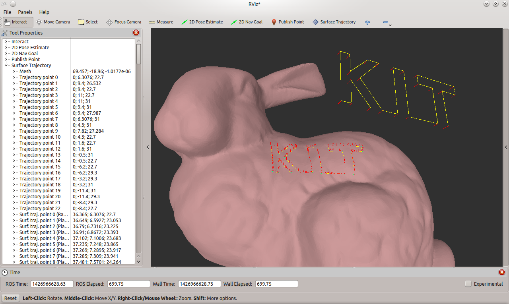
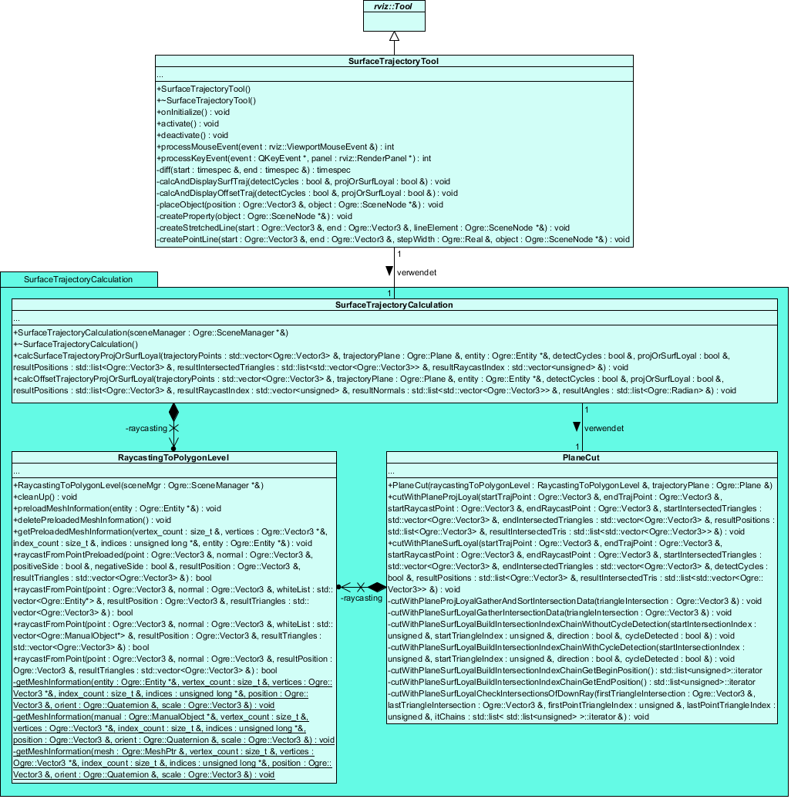

# rviz_surface_trajectory :arrows_counterclockwise:
This code projects arbitrary trajectory patterns onto a triangular mesh in 3D space.

There are two main modes available:
Either the resulting trajectory on the mesh (called "surface-trajectory") is following exactly the contour also in hidden areas
(called "surface-loyal"), or just in the visible region (called "projection-loyal"). As the projected trajectories are intended
for robot movements on object surfaces for surface treatment activities, there is a further post-processing step applied for the
readyily use of the calculated surface-trajectories (called "offset-trajectory").

The implementation is done as a tool-plugin (called "Surface Trajectory") for RViz, which is the visualization tool of the Robot Operating System (ROS),
to allow for interactive visualization and testing. However, the calculation part of the code may be detached from the
tool-plugin and used in different applications.

## RViz Screenshot

## UML Class Diagram

## Getting Started
To use the tool-plugin in RViz follow these steps:
1. Clone the repository to your catkin workspace path `catkin_ws/src/`.
2. Compile the repository, which is a catkin package, using `catkin_make` in your top level workspace folder. The plugin will
then be automatically loaded with RViz.
3. Run RViz with `rosrun rviz rviz` (be sure to first start ROS Master with `roscore`).
4. Use the following commands in RViz for the tool-plugin:

Key                | Function
:----------------- | :------------------------------------------------------------------
T                  | Activate tool-plugin (must be active for the following commands)
Left mouse button  | Place mesh or trajectory pattern points, respectively
Right mouse button | Toggle placement mode for mesh and trajectory pattern points
Q                  | Calculation and visualization of the projection-loyal surface-trajectory
W                  | Calculation and visualization of the surface-loyal surface-trajectory with cycle detection
E                  | Calculation and visualization of the surface-loyal surface-trajectory without cycle detection (Note: If there is a cutting point cycle this will induce an infinity loop.)
Y                  | Calculation and visualization of the projection-loyal offset-trajectory
X                  | Calculation and visualization of the surface-loyal offset-trajectory with cycle detection
C                  | Calculation and visualization of the surface-loyal offset-trajectory without cycle detection (Note: If there is a cutting point cycle this will induce an infinity loop.)
U                  | Start of the time measurement test (part of the thesis evaluation)
L                  | Toggle display of yellow connection lines
N                  | Toggle display of red normal vectors
D                  | Delete the placed blue trajectory pattern points

To load another mesh change `mesh_resource_` in `SurfaceTrajectoryTool.cpp` to a new path and recompile.

### Prerequisites
The code was developed using C++03 and the Ogre3D graphics engine (which is used by RViz). To compile the code with catkin and
run it with RViz you need:

* Robot Operating System (ROS) - version Groovy Galapagos
  * RViz v1.9.36 (Ogre3D v1.7.4 (Cthugha), OpenGL v2.1 (GLSL v1.2))
  
## Author
This was developed in the context of my Bachelor Thesis at the Karlsruhe Institute of Technology (KIT), Germany.

## License
Licensed under the MIT license (see [LICENSE](LICENSE) file for more details).
